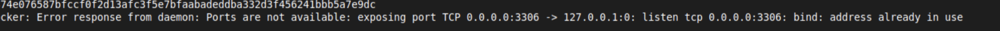
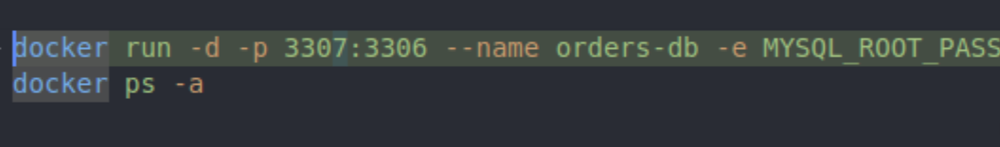
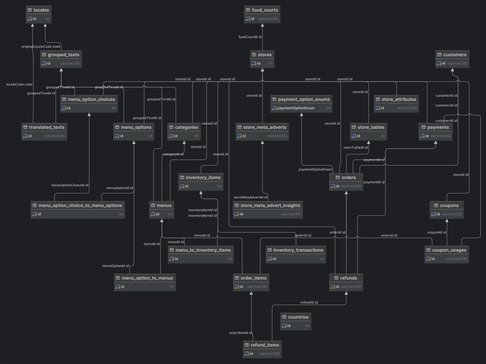

# Create a local docker container with MySql 8.2 and a sample database

- `dump.sql` contains data taken from our live system in Korea but has sensitive data removed
- When the container first starts the `dump.sql` is extracted from dump.sql.qz and then runs to create database named `orders`

## Build container

```
./1_build.sh
```

## Run container

```
./2_run.sh
```

N.B. you may want to change the external post used in the 2_run.sh if you are already using port 3306





## Verify database `orders` is running inside the container

```
./3_connect.sh
```

## Databae diagram



## clean up after

```
./cleanup.sh
```
